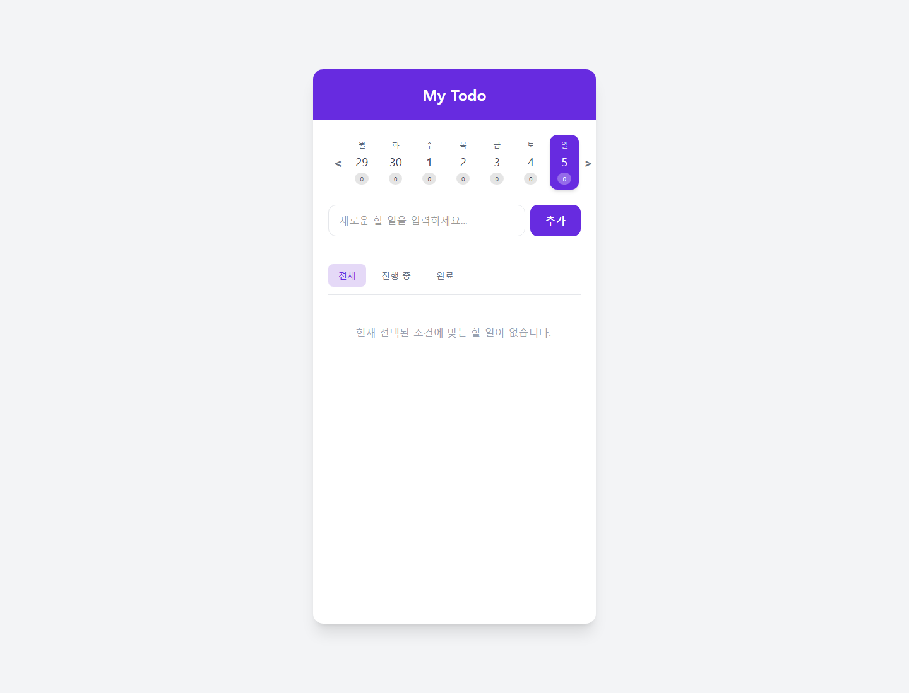
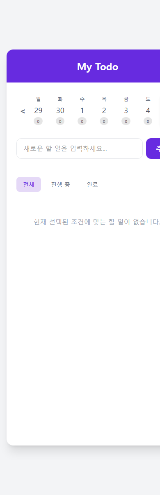

# React Todo App (Assignment 2)

이 프로젝트는 기존 Vanilla JS로 작성된 Todo 앱을 React(Vite) 기반으로 마이그레이션한 결과물입니다. 컴포넌트 단위의 개발과 상태 관리(State)를 통해 UI를 효과적으로 구성했습니다.

## 로컬 캡처

| Desktop | Mobile |
| --- | --- |
|  |  |

## 📷 결과물 미리보기


---

## 🛠 기술 스택
- **프레임워크**: React v18+ (Vite)
- **스타일링**: Tailwind CSS v4
- **상태 관리**: React Hooks (`useState`, `useEffect`)
- **데이터 저장**: Web Storage API (`localStorage`)

## 🚀 주요 기능
1. **Todo CRUD**: 할 일의 추가, 읽기, 수정(인라인), 삭제 기능
2. **상태별 필터링**: 전체 / 진행 중 / 완료 상태 탭 필터링
3. **주간 달력 및 일간 뷰**: 주간 달력으로 주차와 날짜를 이동하며, 선택한 날짜에 등록된 Todo 목록만 렌더링하고 달력 하단에 개수 뱃지를 표시합니다.
4. **데이터 영속성**: `localStorage`와 `useEffect`를 결합하여 데이터를 자동으로 저장하고 새로고침 시 복원합니다.

## 📁 컴포넌트 구조
```text
src/
├── components/
│   ├── TodoInput.jsx       # 할 일 입력 컴포넌트 (빈 값 경고 처리)
│   ├── TodoFilter.jsx      # 상태 필터 탭 컴포넌트
│   ├── TodoList.jsx        # 투두 목록 및 빈 상태 처리 컴포넌트
│   ├── TodoItem.jsx        # 개별 투두 및 인라인 수정 컴포넌트
│   └── WeeklyCalendar.jsx  # 주간 뷰 달력 컴포넌트
├── utils/
│   └── date.js             # 날짜 포맷팅 및 주간 계산 유틸 함수
├── App.jsx                 # 통합 상태 관리 및 메인 UI 레이아웃
├── index.css               # Tailwind CSS 진입점 및 커스텀 스크롤바
└── main.jsx                # React 앱 진입점
```

## ⚙️ 실행 방법
1. 프로젝트를 클론하고 의존성 패키지를 설치합니다.
```bash
npm install
```
2. 개발 서버를 실행합니다.
```bash
npm run dev
```
3. 브라우저에서 `http://localhost:5173`으로 접속하여 확인합니다.
